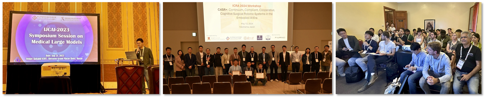

 
<h2><b>Grant Reviewers </b></h2>
<ul>
<li>Education Research Funding Programme (ERFP), Ministry of Education, Singapore</li>
</ul>

 
<h2><b>Program Committees </b></h2>
<ul>
<li><span2><b>Aera Chair</b></span2> of MICCAI 2025</li>
<li><span2><b>Aera Chair</b></span2> of MICCAI 2024</li>
<li><span2><b>Chair</b></span2> of MICCAI 2024 Workshop on Embodied AI and Robotics for Healthcare (EARTH)</li> 
<li><span2><b>Chair</b></span2> of ICRA 2024 Workshop on Continuum, Compliant, Cooperative, Cognitive Surgical Robotic Systems in the Embodied AI Era (C4SR+)</li> 
<li><span2><b>Chair</b></span2> of IJCAI 2023 Symposium Session on Medical Large Models</li> 
<li><span2><b>Chair</b></span2> of IEEE MedAI 2024 Special Session on Embodied AI for Medical Robots</li> 
<li>TPC of International Joint Conference on Artificial Intelligence (IJCAI 2025&2024&2023)</li> 
<li>TPC of IEEE International Conference on Bioinformatics and Biomedicine (BIBM 2025&2024)</li> 
<li>TPC of MICCAI Distributed, Collaborative and Federated Learning (DeCaF) Workshop (2023&2022)</li>
<li>TPC of MICCAI 2021 Deep Generative Models (DGM) Workshop</li> 
</ul>

 
<h2><b>Regular Journal Reviewers </b></h2>
<ul>
<li>npj Digital Medicine</li> 
<li>Medical Image Analysis (MedIA)</li> 
<li>IEEE Transactions on Medical Imaging (TMI)</li>
<li>IEEE Transactions on Image Processing (TIP)</li> 
<li>IEEE Transactions on Neural Networks and Learning Systems (TNNLS)</li>
<li>International Journal of Computer Vision (IJCV)</li> 
<li>IEEE Transactions on Information Forensics and Security (TIFS)</li> 
<li>IEEE Transactions on Circuits and Systems for Video Technology (TCSVT)</li> 
<li>IEEE Transactions on Industrial Informatics (TII)</li> 
<li>IEEE Transactions on Computational Imaging (TCI)</li> 
<li>IEEE Transactions on Audio, Speech and Language Processing (TASL)</li> 
<li>IEEE Journal of Biomedical and Health Informatics (JBHI)</li> 
<li>IEEE Open Journal of Engineering in Medicine and Biology</li> 
<li>Artificial Intelligence in Medicine</li> 
<li>Pattern Recognition</li>
<li>Neural Networks</li>
</ul>

 
<h2><b>Regular Conference Reviewers </b></h2>
<ul>
<li>International Conf. on Medical Image Computing and Computer Assisted Interventions (MICCAI)</li>
<li>The Conference on Neural Information Processing Systems (NeurIPS)</li>
<li>IEEE Conference on Computer Vision and Pattern Recognition (CVPR)</li>   
<li>IEEE International Conference on Computer Vision (ICCV)</li> 
<li>The European Conference on Computer Vision (ECCV)</li> 
<li>The Asian Conference on Computer Vision (ACCV)</li> 
<li>International Joint Conference on Artificial Intelligence (IJCAI)</li>
<li>IEEE International Conference on Robotics and Automation (ICRA)</li> 
<li>IEEE/RSJ International Conference on Intelligent Robots and Systems (IROS)</li> 
<li>IEEE International Conference on Bioinformatics and Biomedicine (BIBM)</li> 
<li>IEEE International Symposium on Biomedical Imaging (ISBI)</li> 
<li>IEEE International Conference on Acoustics, Speech & Signal Processing (ICASSP)</li>  
</ul>

 
    
   Organize workshops on IJCAI-2023 Medical Large Models, ICRA-2024 C4SR+, and MICCAI-2024 EARTH

