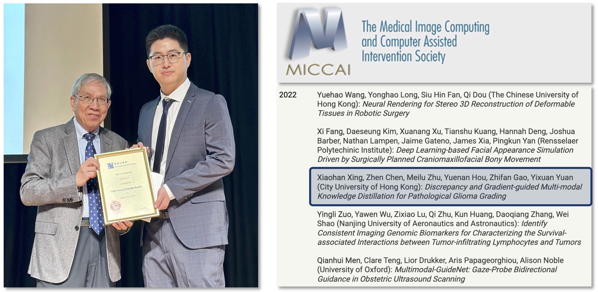

<ul>

<li> <span2><b>Hong Kong Young Scientist Award 2023</b></span2> (Engineering Science) [<a href="https://drive.google.com/file/d/1MafgsqyKKb2tt4ZOKwDPfii4WpEwPUHq/view?usp=sharing">News</a>]</li>
<li> <span2><b>MICCAI 2022 Young Scientist Award</b></span2> (2nd author)</li>
<li> IEEE TMI Distinguished Reviewer Award 2025&2024&2023</li>
<li> MICCAI 2021 Student Travel Award</li>
<li> CityU Institutional Research Tuition Scholarship (RTS)</li>
<li> USTC Academic First-class Scholarship</li>
<li> Xi'an Jiaotong University Outstanding Graduates Award</li>
<li> XJTU Outstanding Student Leaders Award</li>
<li> XJTU Outstanding Students Award (twice)</li>
<li> Wen-Yuan Pan Scholarship</li>
<li> Siyuan Scholarship</li>
<li> National Inspirational Scholarship</li>
</ul>

 
    
   The Hong Kong Young Scientist Award 2023 and MICCAI Young Scientist Award 2022

             

             

              

              
